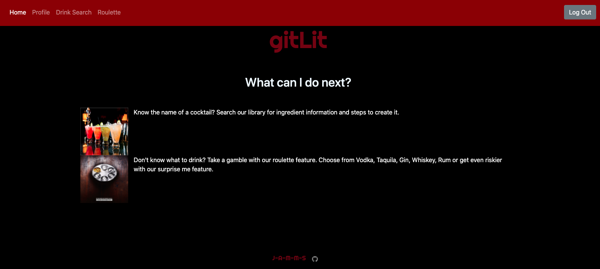
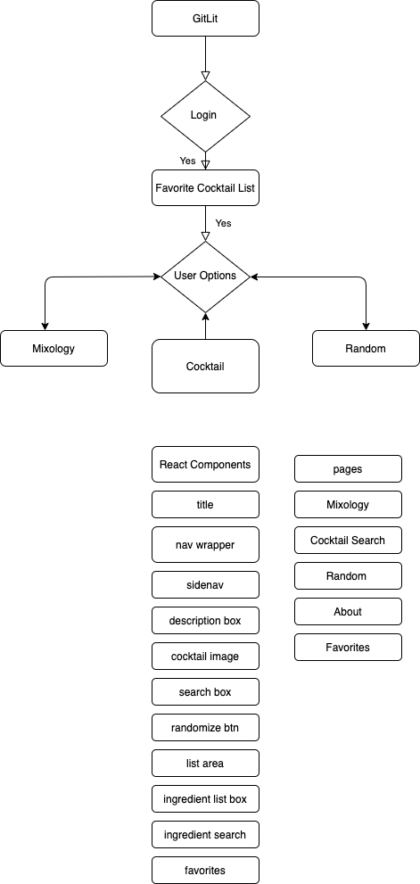

# gitLit

<h1 align='center'>gitLit</h1>
<h2>💡 Project Overview</h2>
<p>Create an App that Looks up cocktails based on the ingredients you have at home.
<a href='https://gitlit-app.herokuapp.com/' target='_blank'>Live Link</a>
</p>



<h2>✨ User Story</h2>

```
AS A DRINKER with a specific cocktail in mind
I WANT the ingredients and steps to make that cocktail
SO THAT I can make the cocktail I want

AS AN INDECISIVE PERSON that only knows what kind of liquor they want
I WANT someone to pick a drink/recipe for me
SO THAT I don't have to make my own decision

AS A FREQUENT BARTENDER that never remembers recipes
I WANT a place to store the ones I like
SO THAT I don't have to search them every time
```

<details>
<summary>✅ White board and wireframes</summary>

</details>

<h2>⚙️ List of Technologies Used</h2>
<ul>
    <li>HTML</li>
    <li>CSS</li>
    <li>JavaScript</li>
    <li>Node</li>
    <li>Express</li>
    <li>React</li>
    <li>MongoDB</li>
    <li>MongoDB Atlas</li>
    <li>Auth0</li>
    <li>Postman</li>
    <li>Heroku</li>
    <li><a href='https://react-bootstrap.github.io/' target='_blank'>React Bootsrap</a></li>
    <li><a href='https://www.thecocktaildb.com/api.php' target='_blank'>The CocktailDB API</a></li>

</ul>
<h2>📓 Contributor(s)</h2>

<h3>Ashley Lerma</h3>
<ul>
    <li><a href='https://github.com/AshleyLerma?tab=repositories' target='_blank'>GitHub</a></li> 
    <li><a href='https://www.linkedin.com/in/ashleylerma/' target='_blank'>LinkedIn</a></li> 
    <li>lerma.scout@gmail.com</li> 
</ul>
<h3>Dre Lajara</h3>
<ul>
    <li><a href='https://github.com/juanlajara/juanlajara.github.io' target='_blank'>GitHub</a></li>
    <li><a href='https://www.linkedin.com/in/juan-andres-lajara-179a8442' target='_blank'>LinkedIn</a></li>
    <li>juanlajara001@gmail.com</li>
</ul>
<h3>Michael Srithapin</h3>
<ul>
    <li><a href='https://github.com/Cranekick50?tab=repositories'>GitHub</a></li>
    <li><a href='https://www.linkedin.com/in/michael-srithapin-84a07438/' target='_blank'>LinkedIn</a></li>
    <li>michael.srithapin@gmail.com</li>
</ul>
<h3>Marlon Mora</h3>
<ul>
    <li><a href='https://github.com/marlon20m'>GitHub</a></li>
    <li><a href='https://www.linkedin.com/in/giraldo-marlon/' target='_blank'>LinkedIn</a></li>
    <li>marlonmora.ndr@gmail.com</li>
</ul>
<h3>Joshua Bogart</h3>
    <li><a href='https://github.com/joshuabogart?tab=repositories' target='_blank'>GitHub</a></li> 
    <li><a href='https://www.linkedin.com/in/joshua-bogart-97026b117/' target='_blank'>LinkedIn</a></li> 
    <li>joshua.bogart.ndt@gmail.com</li>

<h2>💡 Special Thanks</h2>
<ul>
    <li><a href='https://www.patreon.com/thedatadb' target='_blank'>The datadb Team </a></li>
</ul>
<h2> Project Board</h2>

https://github.com/orgs/J-A-M-M-S/projects/1?add_cards_query=is%3Aopen

<h2>⚓ Acceptance Criteria / MVP</h2>

- GIVEN I am looking to make a cocktail
- WHEN I open the app
- THEN I am given the option to login or sign up

- WHEN I login
- THEN I am given the option of 3 pages

- WHEN I want to see my profile and favorite drinks
- THEN I can view that info on my Profile page

- WHEN I choose the cocktail I want
- THEN I am given the recipe and photo

- WHEN I want a specific cocktail
- THEN I can search the cocktail name

- WHEN I search a specific cocktail
- THEN I am given the recipe and photo

- WHEN I want a random cocktail
- THEN I am given 4 base liqour options or a totally random button

- WHEN I click my preferred liquor
- THEN I am given a random cocktail recipe that uses that

- WHEN I favorite a cocktail
- THEN It is added to my favorites list
